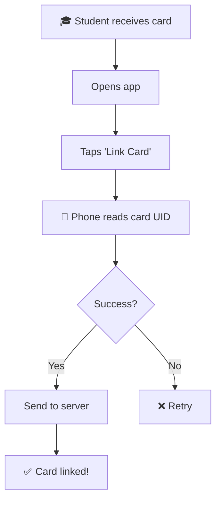
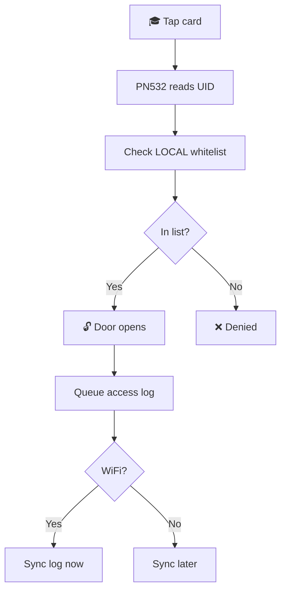
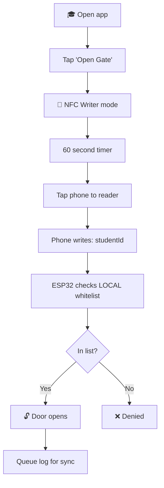
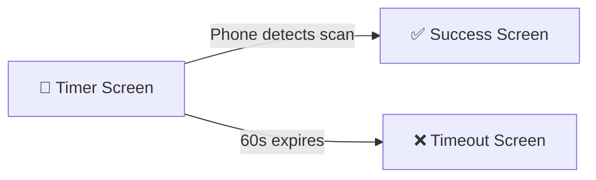
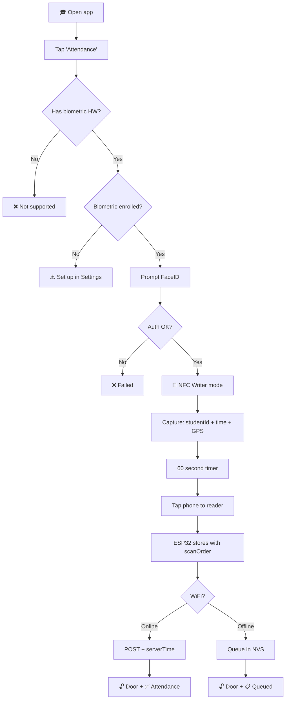
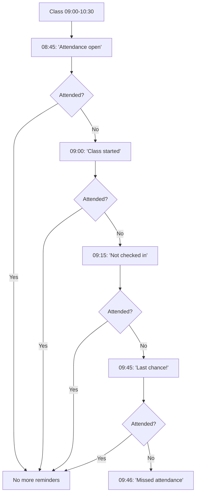

# Smart Classroom System

A two-node wireless system for secure gate access and intelligent energy management.

---

## System Overview

| Node | Role | Components |
|------|------|------------|
| **Node A (Gatekeeper)** | Door access control | ESP32 + PN532 NFC + Relay |
| **Node B (Watchman)** | Occupancy monitoring & power control | ESP32 + HLK-LD2410C Radar + Relay |
| **Communication** | ESP-NOW (direct ESP-to-ESP) | ~50m indoor range |

---

## Tech Stack

| Layer | Technology | Why |
|-------|------------|-----|
| **Mobile App** | React Native + Expo | Cross-platform, TypeScript, EAS cloud builds |
| **Backend** | Convex | Real-time, TypeScript, scheduled functions |
| **Firmware** | Arduino/PlatformIO | ESP32 HTTP client to Convex |

### Mobile App Libraries

| Feature | Library |
|---------|---------|
| NFC | `react-native-nfc-manager` |
| Biometrics (FaceID) | `expo-local-authentication` |
| GPS | `expo-location` |
| Push Notifications | `expo-notifications` |

### Architecture

```
┌─────────────────────────────────────────┐
│           MOBILE APP                    │
│   React Native + Expo                   │
└────────────────┬────────────────────────┘
                 │ TypeScript
                 ▼
┌─────────────────────────────────────────┐
│            BACKEND                      │
│   Convex (real-time + scheduled jobs)   │
└────────────────┬────────────────────────┘
                 │ HTTP
                 ▼
┌─────────────────────────────────────────┐
│           HARDWARE                      │
│   ESP32 + PN532 (local whitelist)       │
└─────────────────────────────────────────┘
```

## Hardware Inventory

| Component | Qty | Function | Placement |
|-----------|-----|----------|-----------|
| ESP32 WROOM-32 | 2 | Microcontrollers | Door frame / Ceiling |
| PN532 NFC Module | 1 | Reader/Tag Emulation | Outside door |
| HLK-LD2410C | 1 | mmWave Presence Sensor | Ceiling (facing room) |
| 5V Relay Module | 2 | Lock control / Power switch | Door frame / Electrical box |
| NTAG215 Cards | 10 | Physical student keys | Student possession |

---

## Wiring Diagrams

### Node A: Gatekeeper (Door)

| PN532 NFC | ESP32 Pin | Relay #1 | ESP32 Pin |
|-----------|-----------|----------|-----------|
| VCC | VIN (5V) | VCC | VIN (5V) |
| GND | GND | GND | GND |
| SDA | GPIO 21 | IN | GPIO 4 |
| SCL | GPIO 22 | — | — |

### Node B: Watchman (Ceiling)

| HLK-LD2410C | ESP32 Pin | Relay #2 | ESP32 Pin |
|-------------|-----------|----------|-----------|
| VCC | VIN (5V) | VCC | VIN (5V) |
| GND | GND | GND | GND |
| TX | GPIO 16 (RX2) | IN | GPIO 5 |
| RX | GPIO 17 (TX2) | — | — |

> ⚠️ **Critical:** Node B must be powered by a separate always-on circuit. If Relay #2 controls its own power, opening it kills the ESP32.

---

## User Flows

### Flow 1: Card Onboarding

Student links their physical NFC card to their account (one-time setup).



---

### Flow 2: Physical Card Access

Student taps card. **ALWAYS uses local whitelist (instant, no server call).**



> 💡 **No server call during tap.** Whitelist is pre-synced from server.

---

### Flow 3: Phone Access (Open Gate Only)

No biometric needed. **ALWAYS uses local whitelist.**



**Payload:** `{ studentId, action: "OPEN_GATE" }`

**App Screen States:**



| State | UI | Trigger |
|-------|-----|---------|
| **Timer** | "⏱️ 47 seconds - Tap phone to reader" | User clicks Open Gate |
| **Success** | "✅ Scanned! Door should open" | NFC write callback fires |
| **Timeout** | "❌ Time expired, try again" | 60 seconds pass |

---

### Flow 4: Attendance (Biometric Required)

Opens door AND records attendance. **Requires FaceID/Fingerprint.**



**Payload:** `{ studentId, deviceTime, gps, action: "ATTENDANCE" }`

**ESP32 adds:** `{ scanOrder, espTime, synced: false }`

---

### Flow 5: Energy Saving

Radar cuts power when room is empty for 15 minutes.

```
STATE MACHINE:

┌──────────────────────────────────────────────────────────────┐
│                                                              │
│   ┌─────────┐    No motion     ┌─────────┐    15 min     ┌─────────┐
│   │OCCUPIED │ ───────────────► │  GRACE  │ ────────────► │ STANDBY │
│   │Power ON │                  │Power ON │               │Power OFF│
│   └─────────┘                  └─────────┘               └─────────┘
│        ▲                            │                         │
│        │                            │ Motion                  │ Motion
│        │                            ▼                         ▼
│        └──────────────────── INSTANT RECOVERY ◄───────────────┘
│                                                              │
└──────────────────────────────────────────────────────────────┘
```

| State | Power | Trigger to next state |
|-------|-------|----------------------|
| **OCCUPIED** | ON | No motion → GRACE |
| **GRACE** | ON | 15 min no motion → STANDBY |
| **STANDBY** | OFF | Motion detected → OCCUPIED |

---

## Offline Mode

System is **local-first**. No server calls during validation. Server only manages whitelist updates.

### Architecture

**Two-way sync between ESP32 and Server:**

| Direction | What | When |
|-----------|------|------|
| **Server → ESP32** | Whitelist updates | Periodic (every hour) or on boot |
| **ESP32 → Server** | Access logs + attendance | When WiFi available |

```
┌────────────────────────────────────────────────────────────────┐
│                     SERVER (Convex)                            │
│  • Manage students & rooms                                     │
│  • Push whitelist to each ESP32                                │
│  • Receive logs from ESP32                                     │
└───────────────────────────┬────────────────────────────────────┘
                            │
            ┌───────────────┴───────────────┐
            │         WiFi Sync             │
            │  (not during tap, only sync)  │
            └───────────────┬───────────────┘
                            │
┌───────────────────────────┴────────────────────────────────────┐
│                     ESP32 (Local)                              │
│  • Store room whitelist in NVS                                 │
│  • Validate taps LOCALLY (instant)                             │
│  • Queue logs until WiFi available                             │
└────────────────────────────────────────────────────────────────┘
```

**Key point:** Student taps → validated locally → door opens. No WiFi needed.

### What Happens When

| Event | Action |
|-------|--------|
| **Student taps** | Check LOCAL whitelist → instant response |
| **WiFi available** | Sync queued logs + check for whitelist updates |
| **Admin adds student** | Server updates whitelist → ESP32 pulls on next sync |
| **WiFi down** | Everything still works, logs queue locally |

### Timestamp Handling

| Mode | Source | Label | Accuracy |
|------|--------|-------|----------|
| Online | Server | `timestampServer` | ✅ Accurate |
| Offline | ESP32 | `timestampLocal` | ⚠️ May drift |

**On reconnect:** Calculate offset, correct queued records.

---

### Anti-Cheat Mechanisms

#### 1. Attendance Time Window

**Single scan only** (no scan OUT = no queue at end of class).

Window: **15 min before class** → **mid-class** (50% of class duration)

```
Class: 09:00 - 10:30 (90 min)

            ATTENDANCE WINDOW
        ◄─────────────────────►
        
08:45   09:00              09:45   10:30
  │       │                  │       │
  ├───────┼──────────────────┤       │
  │15 min │     OPEN         │CLOSED │
  │before │   (can scan)     │       │
```

| Attempt Time | Class 09:00-10:30 | Result |
|--------------|-------------------|--------|
| 08:30 | Too early | ❌ Rejected |
| 08:50 | 10 min before | ✅ Valid |
| 09:15 | During class | ✅ Valid |
| 09:45 | Mid-class cutoff | ✅ Valid (last chance) |
| 10:00 | Past mid-class | ❌ Rejected |

#### 2. Phone Internet Check

Phone includes its internet status in the payload:

```json
{
  "studentId": "stu_123",
  "deviceTime": 1706012345,
  "timeSource": "ntp",      // "ntp" = internet time, "local" = device clock
  "hasInternet": true,
  "gps": { "lat": 13.7, "lng": 100.5 },
  "action": "ATTENDANCE"
}
```

| timeSource | Meaning | Trust Level |
|------------|---------|-------------|
| `ntp` | Phone fetched time from internet | ✅ High |
| `local` | Phone used device clock | ⚠️ Low |

#### 3. Suspicious Pattern Detection

Flag students who consistently have "no internet":

```typescript
// Server-side check
function checkSuspiciousPatterns(studentId: string, logs: AttendanceLog[]) {
  const recentLogs = logs.filter(l => l.studentId === studentId && isWithinDays(l, 7));
  const noInternetCount = recentLogs.filter(l => l.timeSource === "local").length;
  const totalCount = recentLogs.length;
  
  // If >50% of attendance has no internet in past week → suspicious
  if (noInternetCount / totalCount > 0.5) {
    alertAdmin({
      type: "SUSPICIOUS_PATTERN",
      studentId,
      message: `${noInternetCount}/${totalCount} scans with no internet this week`
    });
  }
}
```

**Red flags to auto-detect:**
| Pattern | Action |
|---------|--------|
| >50% "no internet" in 7 days | ⚠️ Flag to admin |
| Attendance outside time window | ❌ Reject |
| GPS > 100m from room | ⚠️ Flag to admin |
| deviceTime vs espTime > 5 min | 🚨 Use espTime only |
| **1 deviceId + 2 accounts in 12h** | 🚨 **Account sharing** |

#### 5. Device Binding (Anti-Sharing)

**Problem:** Student A logs into app, scans attendance, logs out, gives phone to Student B, who logs in and scans.

**Solution:** Include `deviceId` in every payload. Server tracks which devices are used by which accounts.

```json
{
  "studentId": "stu_123",
  "deviceId": "E621E1F8-C36C-495A-93FC-0C247A3E6E5F",
  "deviceTime": 1706012345,
  "action": "ATTENDANCE"
}
```

**Server-side check:**
```typescript
function checkDeviceSharing(deviceId: string, studentId: string) {
  const recentScans = getScansInLast12Hours(deviceId);
  const uniqueAccounts = new Set(recentScans.map(s => s.studentId));
  
  if (uniqueAccounts.size > 1) {
    // 🚨 Same device, multiple accounts = sharing
    alertAdmin({
      type: "DEVICE_SHARING",
      deviceId,
      accounts: [...uniqueAccounts],
      message: `Device used by ${uniqueAccounts.size} accounts in 12h`
    });
  }
}
```

| Scenario | Result |
|----------|--------|
| 1 device, 1 account | ✅ OK |
| 1 device, 2 accounts in 12h | 🚨 Flag both students |
| 1 device, 2 accounts in 7 days | ⚠️ Maybe new phone, allow |

#### 4. Scan Order (Position)

Students can lie about timestamp. They **cannot** lie about position in line.

| scanOrder | studentId | deviceTime | espTime | Status |
|-----------|-----------|------------|---------|--------|
| 1 | stu_007 | 09:01:23 | 09:01:25 | ✅ OK |
| 2 | stu_003 | 09:01:45 | 09:01:30 | ✅ OK |
| 3 | stu_012 | **08:55:00** | 09:01:35 | 🚨 SUS |
| 4 | stu_001 | 09:02:10 | 09:01:40 | ✅ OK |

→ Student #3 claims 08:55 but is position 3. **Use espTime as truth.**

**Scan Order Memory (ESP32 NVS):**

| Data per scan | Size |
|---------------|------|
| `scanOrder` (uint16) | 2 bytes |
| `studentId` (8 chars) | 8 bytes |
| `espTime` (uint32) | 4 bytes |
| `synced` flag | 1 byte |
| **Total per scan** | **~15 bytes** |

| Scenario | Calculation | Result |
|----------|-------------|--------|
| 50 scans/day × 15 bytes | 750 bytes/day | Tiny |
| NVS usable space | ~12-16 KB | Huge margin |
| Days before overflow (no sync) | 16,000 ÷ 750 | **~21 days** |

> 💡 With WiFi syncing every hour, you'll never hit NVS limits. If overflow occurs (rare), oldest records are deleted.

**Flow:**
```
Class starts → scanOrder = 0
Student 1 taps → scanOrder = 1, queued
Student 2 taps → scanOrder = 2, queued
...
WiFi available → Batch upload all → Clear queue
Next class → scanOrder = 0 (reset per class session)
```

---

### Local Whitelist

Each ESP32 stores only students allowed in **its room**:

```json
{
  "whitelistVersion": 42,
  "entries": [
    { "cardUID": "04:A3:2B:...", "studentId": "stu_001" },
    { "cardUID": "04:B7:3C:...", "studentId": "stu_007" }
  ]
}
```

**Sync:** `GET /whitelist?room=101&version=42` → 304 or new list.

---

## Access Control Model

### User Roles

| Role | Door Access | Scan IN | Scan OUT | Biometric | Notes |
|------|-------------|---------|----------|-----------|-------|
| **Student** | Enrolled rooms only | ✅ Required | ❌ Not required | IN only | GPS geofencing |
| **Teacher** | All rooms | ✅ Required | ✅ Required | Both IN & OUT | Logs teaching hours |
| **Cleaner/Staff** | All rooms | ❌ Optional | ❌ Optional | None | Access logged only |
| **Admin** | All rooms + dashboard | ❌ Optional | ❌ Optional | None | Can manage everything |

> 💡 **Why no student scan-out?** Students rush to leave class simultaneously. Requiring scan-out creates bottlenecks. Use radar occupancy detection instead if class duration data is needed.

> ⚠️ **Biometric Clarification:** We use on-device authentication (FaceID/Fingerprint). The app receives `true/false` — **no biometric data is collected or transmitted**. Only GPS is collected for geofencing.

**How it works:**
- `role: "student"` → Check `allowedRooms` array
- `role: "teacher" | "cleaner" | "admin"` → Skip room check, allow all

### Database Schema

```typescript
// users (students, teachers, cleaners, admins)
{
  _id: "usr_12345",
  name: "John Doe",
  role: "student" | "teacher" | "cleaner" | "admin",
  status: "enrolled" | "graduated" | "expelled",  // Never delete, just archive
  cardUID: "04:A3:2B:1C:7D:00:00",    // 1 account = 1 card (linking new card overwrites old)
  deviceId: "E621E1F8-C36C...",       // Bound phone for anti-sharing
  allowedRooms: ["room_101", "room_102"]  // Only used if role = "student"
}
```

> 💡 **Archiving Policy:** Users are never deleted. When a student graduates or is expelled, set `status` accordingly. Old attendance records remain for historical reference.

> ⚠️ **1:1 Card Binding:** Each account can only have ONE linked NFC card. If a student links a new card, the old `cardUID` is overwritten. This prevents students from having multiple cards.

```typescript
// rooms
{
  _id: "room_101",
  name: "Computer Lab 101",
  nodeId: "esp32_node_a_001",
  gps: { lat: 13.7563, lng: 100.5018 }
}

// accessLogs
{
  studentId: "stu_12345",
  roomId: "room_101",
  method: "card" | "phone",
  action: "OPEN_GATE" | "ATTENDANCE",
  result: "granted" | "denied",
  timestamp: "2026-01-22T10:30:00Z",
  timestampType: "server" | "local",
  scanOrder?: 5,
  gps?: { lat, lng }
}
```

---

## Security Strategy

| Layer | Implementation |
|-------|----------------|
| **Something you have** | NFC Card / iPhone |
| **Something you are** | FaceID (attendance only) |
| **Somewhere you are** | GPS verification |
| **Replay protection** | scanOrder + nonce |
| **Offline security** | Local whitelist, no signing keys |

### Threat Mitigations

| Threat | Mitigation |
|--------|------------|
| Fake studentId | Check whitelist |
| Fake timestamp | Use scanOrder + espTime |
| Fake GPS | Flag if > 100m from room |
| Replay attack | lastScan[studentId] < 30 min |
| Stolen ESP32 | No secrets stored |
| Power loss | NVS (flash), not RAM |

---

## Software Components

### Firmware (ESP32)
- [ ] NFC read/write handling
- [ ] Local whitelist validation
- [ ] Attendance queue (NVS)
- [ ] WiFi check + sync
- [ ] OTA updates
- [ ] NTP time sync

### Backend (Convex)
- [ ] Student/room management
- [ ] Whitelist endpoint
- [ ] Attendance validation
- [ ] Access logs

### Mobile App (iOS)
- [ ] NFC Writer mode (Core NFC)
- [ ] FaceID (LocalAuthentication)
- [ ] GPS capture
- [ ] Demo mode for App Store
- [ ] Push notifications (see below)

### Push Notifications

Server sends push notifications based on class schedule:

| Trigger | Time | Message |
|---------|------|---------|
| **Window opens** | 15 min before class | "📚 CS101 attendance is now open" |
| **Class starts** | Exact start time | "⏰ CS101 has started - scan now!" |
| **Reminder** | 15 min after start | "⚠️ You haven't checked in for CS101" |
| **Last chance** | Mid-class (cutoff) | "🚨 Last chance to scan for CS101!" |
| **Missed** | After cutoff | "❌ You missed CS101 attendance" |



**Implementation:** Use scheduled push via Convex + Expo Push Notifications (or APNs).

---

## System Management

### Device Registration (Chip ID)

Each ESP32 has a unique hardware ID. Use this for automatic registration:

```
ESP32 first boot:
   │
   ├─► POST /register { chipId: "A1B2C3D4E5F6" }
   │
   ▼
Server creates: { chipId: "A1B2C3D4E5F6", roomId: null, name: "Unassigned" }
   │
   ▼
Admin dashboard: "New device! Assign to Room 305"
   │
   ▼
Server updates: { chipId: "A1B2C3D4E5F6", roomId: "room_305" }
```

**Database schema:**
```typescript
// devices
{
  chipId: "A1B2C3D4E5F6",      // Permanent hardware ID
  roomId: "room_305",          // Assigned from admin panel
  name: "Room 305 Door",       // Human-readable
  firmwareVersion: "1.2.3",
  lastSeen: "2026-01-23T12:00:00Z",
  status: "online"
}
```

> ✅ Same firmware for all devices. Room assignment done in admin panel.

---

### WiFi Credential Management

Server stores WiFi credentials. ESP32 pulls on boot:

```typescript
// wifiCredentials (single row)
{
  primary:   { ssid: "SchoolWiFi", pass: "current123" },
  secondary: { ssid: "SchoolWiFi", pass: "newpass456" }
}
```

**ESP32 connection logic:**
1. Try `primary` → Connected? ✅ Done
2. Failed? Try `secondary` → Connected? ✅ Report to server
3. Both failed? Enter AP mode for manual config

**Admin workflow to change WiFi password:**
1. Add new password as `secondary` in dashboard
2. Wait 1 hour (all ESP32s pull new creds)
3. Change actual WiFi password on router
4. ESP32s reconnect using `secondary`
5. Promote `secondary` → `primary`

> ✅ Zero downtime WiFi password changes.

---

### OTA Firmware Updates

ESP32 pulls firmware updates on boot:

| Component | Method | Downtime |
|-----------|--------|----------|
| ESP32 Firmware | HTTP OTA | ~30 sec reboot |
| Mobile App (JS) | Expo Updates | 0 (instant) |
| Backend | `npx convex deploy` | 0 |

**Staged rollout for safety:**
```typescript
// firmwareVersions
{
  version: "1.2.3",
  rolloutPercentage: 10,  // Start with 10%
  url: "https://storage/.../v1.2.3.bin"
}
```

- Day 1: 10% of devices update → Watch for errors
- Day 2: 50% of devices update → Still OK?
- Day 3: 100% of devices update

> ⚠️ If bug found, set `rolloutPercentage: 0` to pause immediately.

---

### Heartbeat Monitoring

ESP32 sends heartbeat every 5 minutes:

```typescript
POST /heartbeat {
  chipId: "A1B2C3D4E5F6",
  uptime: 12345,
  freeMemory: 45000,
  firmwareVersion: "1.2.3"
}
```

**Scheduled job (every 10 min):**
- Find devices where `lastSeen > 15 min ago`
- Alert admin: "Room 305 is offline!"

---

### Power Failure Recovery

Everything survives power loss:

| Data | Storage | Survives Reboot? |
|------|---------|------------------|
| Whitelist | NVS (flash) | ✅ Yes |
| Queued attendance | NVS (flash) | ✅ Yes |
| Clock | NTP sync on boot | ✅ Yes |

**On boot:**
1. Connect WiFi (try primary, then secondary)
2. Sync NTP time
3. Check for firmware updates
4. Pull latest whitelist
5. Sync any queued logs
6. Resume normal operation

---

## Admin Dashboard

### Core Features

| Feature | Description |
|---------|-------------|
| **Device Management** | View all ESP32s, assign to rooms, see online/offline status |
| **User Management** | Add/edit students, teachers, cleaners. Assign rooms. |
| **Attendance Logs** | View, filter, export attendance data |
| **Suspicious Activity** | View flagged students (GPS mismatch, device sharing, etc.) |
| **Firmware Updates** | Upload new firmware, control rollout % |
| **Audit Log** | Who did what when (all admin actions logged) |

### Emergency Override

Admin can bypass the system when needed:

| Override | Effect |
|----------|--------|
| **Unlock Room X** | Opens door immediately (logged) |
| **Disable Room X** | Door stays unlocked, attendance disabled |
| **Lock All** | Emergency lockdown (all doors locked) |

> ⚠️ All overrides are logged with admin ID and timestamp.

### Room Control Panel

Admin can view and control every component in each room:

**Real-time Status (per room):**
```
┌─────────────────────────────────────────────────────────────┐
│ Room 305 - Computer Lab                                     │
├─────────────────────────────────────────────────────────────┤
│                                                             │
│  🔌 ESP32 (Door)      ● Online    v1.2.3    ↻ 2 min ago    │
│  🔌 ESP32 (Radar)     ● Online    v1.2.3    ↻ 2 min ago    │
│  📡 Radar Sensor      ● Detecting motion                    │
│  🔒 Door Lock         ● Locked                              │
│  💡 Power Relay       ● ON                                  │
│  👥 Occupancy         ● 12 people (estimated)               │
│                                                             │
├─────────────────────────────────────────────────────────────┤
│  [🔓 Unlock]  [💡 Lights ON]  [💡 Lights OFF]  [⚠️ Override] │
└─────────────────────────────────────────────────────────────┘
```

**Manual Controls:**
| Control | Effect |
|---------|--------|
| **Unlock Door** | Opens door for 10 seconds |
| **Lights ON** | Force power relay ON |
| **Lights OFF** | Force power relay OFF (overrides radar) |
| **Reset Radar** | Restart motion detection |
| **Reboot ESP32** | Remote restart device |

---

## Data Retention

| Data Type | Retention | Reason |
|-----------|-----------|--------|
| Attendance logs | **4 years** | Academic records |
| Access logs (door) | 1 year | Security |
| Device heartbeats | 30 days | Debugging |
| Audit logs | 4 years | Accountability |

**Backup:** Monthly export to CSV/Excel stored offline.

---

## User Onboarding

### New Student Flow

```
1. Admin creates account in dashboard
   │
   ▼
2. Student receives login credentials (email/SMS)
   │
   ▼
3. Student downloads app, logs in
   │
   ▼
4. Student taps "Link Card" → Scans NFC card
   │
   ▼
5. Card linked to account ✅ Ready to use
```

### Lost Card

```
1. Student reports to admin
   │
   ▼
2. Admin gives new card
   │
   ▼
3. Student scans new card in app
   │
   ▼
4. Old card automatically unlinked (1:1 binding)
```

---

## Deployment Strategy

| Phase | Scope | Goal |
|-------|-------|------|
| **Phase 1** | Personal testing | Validate hardware works |
| **Phase 2** | 1 classroom | End-to-end testing with real users |
| **Phase 3** | 1 building/floor | Scale testing, iron out issues |
| **Phase 4** | Campus-wide | Full deployment |

> Start small. Fix issues. Expand gradually.

---

## Development Phases

### Phase 1: Hardware ✅
- [x] Order components

### Phase 2: Validation
- [ ] ESP32 + PN532 (I2C)
- [ ] ESP32 + HLK-LD2410C (UART)
- [ ] ESP-NOW between nodes
- [ ] Relay actuation

### Phase 3: Core Logic
- [ ] 15-min timer
- [ ] NFC token read/write
- [ ] Convex backend

### Phase 4: Integration
- [ ] Node A ↔ Server ↔ Node B
- [ ] iOS app with FaceID + NFC
- [ ] End-to-end testing

### Phase 5: Deployment
- [ ] Install in classroom
- [ ] Wire to door lock
- [ ] Production deployment

---

## Bill of Materials

| Item | Price |
|------|-------|
| USB-C Cables (2) | $5.33 |
| HLK-LD2410C Radar | $2.20 |
| ESP32 WROOM-32 (2pcs) | $9.29 |
| PN532 NFC Module (2pcs) | $8.37 |
| 5V Relay Module (2pcs) | $1.32 |
| Dupont Wires | $3.99 |
| NTAG215 Cards (10pcs) | $6.48 |
| **Total** | **~$37** |

---

## Cost Projections (~100 students)

| Service | Free Tier | Expected Usage | Monthly Cost |
|---------|-----------|----------------|--------------|
| **Convex** | 1M function calls | ~50k calls | **$0** |
| **Expo Push** | Unlimited | ~10k/month | **$0** |
| **EAS Build** | 15 builds/month | 2-3 builds | **$0** |
| **Total** | | | **$0/month** |

> 💡 Free tier covers up to ~500-1000 active users. After that, Convex is ~$25/month.

---

## Admin Notifications

Server pushes alerts to admins for critical events:

| Event | Alert | Priority |
|-------|-------|----------|
| **Device offline** | "Room 305 door is offline (15 min)" | 🔴 High |
| **Suspicious activity** | "Student X flagged: 3 GPS mismatches this week" | 🟠 Medium |
| **Device sharing** | "Device used by 2 accounts in 12h" | 🔴 High |
| **Sensor malfunction** | "Room 201 radar not reporting" | 🟠 Medium |
| **Firmware update failed** | "ESP32 A1B2C3 update stuck" | 🟡 Low |

**Teacher notifications:**
| Event | Alert |
|-------|-------|
| **Class starting** | "CS101 starting in 5 min, 8/30 students checked in" |
| **Low attendance** | "Only 12/30 students checked in for CS101" |

---

## Accessibility

| Feature | Implementation |
|---------|----------------|
| **Haptic feedback** | Vibration on successful scan |
| **VoiceOver support** | All buttons properly labeled |
| **High contrast** | Dark mode with clear status indicators |
| **Large touch targets** | Minimum 44pt tap areas |

---

## Localization (i18n)

| Language | Code | Status |
|----------|------|--------|
| **English** | `en` | Primary |
| **Khmer** | `km` | Secondary |

> 💡 Use `react-i18next` or Expo's `expo-localization` for language detection.

---

## Hardware Safety

### Magnetic Door Lock (Fail-Safe)

| Power State | Lock State | Reason |
|-------------|------------|--------|
| **Power ON** | 🔒 Locked | Normal operation |
| **Power OFF** | 🔓 Unlocked | Fire safety compliance |

> ⚠️ **Fail-safe design:** Magnetic locks require power to stay locked. On power outage, doors automatically unlock. This is intentional for fire safety — no UPS needed.

---

## Edge Cases

### Substitute Teacher

**Flow (designed for non-tech admins):**
```
1. Admin opens dashboard → "Add User"
2. Enters: Name, Phone, Role: "Teacher", Status: "Temporary"
3. System sends SMS/Email with login link
4. Sub logs in → Can access all rooms for today
5. End of day → Admin sets Status: "Inactive" (or auto-expires)
```

> 💡 **Keep it simple:** Same flow as adding any teacher, just mark as "Temporary". No special code needed.

### Manual Attendance Override

**When:** Student arrives late with valid excuse (doctor's note, etc.)

**Teacher Flow:**
```
1. Teacher opens app → "My Classes" → "CS101"
2. Views attendance roster for today
3. Taps absent student → "Mark Present (Manual)"
4. Enters reason: "Doctor's note"
5. Server logs: { method: "manual", addedBy: "teacher_123", note: "Doctor's note" }
```

> 💡 Teachers can only edit attendance for their own classes. Admins can edit any class.

### Data Migration

**Phase 1 (Now):** Manual data entry for demo/pilot
**Phase 2 (Later):** Import from existing MySQL system

```
Existing System (MySQL) → Export CSV → Convex Import Script → Our System
```

> ⚠️ **Deferred:** Data shape unknown. Focus on getting system working first, then work with school IT for migration.

---

## Demo Mode (App Store)

> ⚠️ **REMINDER:** iOS App Store requires apps to be testable without real hardware.

**Implementation:**
- Add "Demo Mode" toggle in Settings (hidden, triple-tap logo to reveal)
- Mock NFC scans with fake success responses
- Skip biometric check (return `true`)
- Show fake "Door Opened!" confirmation

**For App Store Review:**
- Include demo credentials in App Store notes
- Reviewer can test full flow without ESP32 hardware

---

## In-App Issue Reporting

### Automatic Prompt

When user is waiting to scan (NFC writer mode active):

```
0-15 sec:  [Timer Screen] "⏱️ 45 seconds - Tap phone to reader"
           └── Small "Having trouble?" link at bottom

15-30 sec: [Timer Screen] "⏱️ 30 seconds - Tap phone to reader"
           └── Button EXPANDS: "🆘 Having trouble? Tap here"

After tap: [Issue Report Screen]
           • What's wrong?
             ○ Door not responding
             ○ NFC not detecting my phone
             ○ Reader seems broken
             ○ Other: [text field]
           • [Submit Report]
```

### What Happens

```
User submits report
  └→ Push notification to admin: "🚨 Room 305: NFC issue reported by John Doe"
  └→ Logged in dashboard with timestamp, user, room, issue type
  └→ User sees: "✅ Admin notified. Try the next door or wait for help."
```

---

## Remote Debugging

### ESP32 Log Upload

ESP32 sends debug logs to Convex for remote troubleshooting:

```typescript
// deviceLogs (Convex table)
{
  chipId: "A1B2C3D4E5F6",
  timestamp: "2026-01-23T12:00:00Z",
  level: "error" | "warn" | "info" | "debug",
  message: "NFC read timeout after 5000ms",
  metadata: { attempts: 3, lastUID: null }
}
```

**What gets logged:**

| Event | Level | Example |
|-------|-------|---------|
| NFC read success | `info` | "Card read: 04:A3:2B:..." |
| NFC read timeout | `warn` | "NFC timeout after 5s" |
| WiFi disconnect | `warn` | "WiFi lost, queuing logs" |
| Relay actuation | `info` | "Door unlocked for 5s" |
| Boot/restart | `info` | "Boot: v1.2.3, free mem: 45KB" |
| Crash/exception | `error` | "Stack overflow in task X" |

**Retention:** 7 days (auto-delete old logs to save space)

**Admin Dashboard:** Filter logs by device, level, time range. Search for errors.

> 💡 **Remote fix:** If you see "NFC timeout" errors spiking, you know something's wrong without being on-site.

---

## Resources

- [ESP-NOW Docs](https://docs.espressif.com/projects/esp-idf/en/latest/esp32/api-reference/network/esp_now.html)
- [PN532 Library](https://github.com/adafruit/Adafruit-PN532)
- [HLK-LD2410 Library](https://github.com/ncmreynolds/ld2410)
- [Convex Docs](https://docs.convex.dev/)
