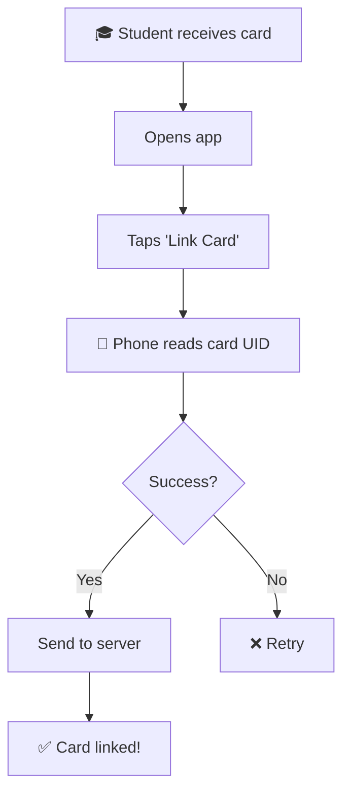
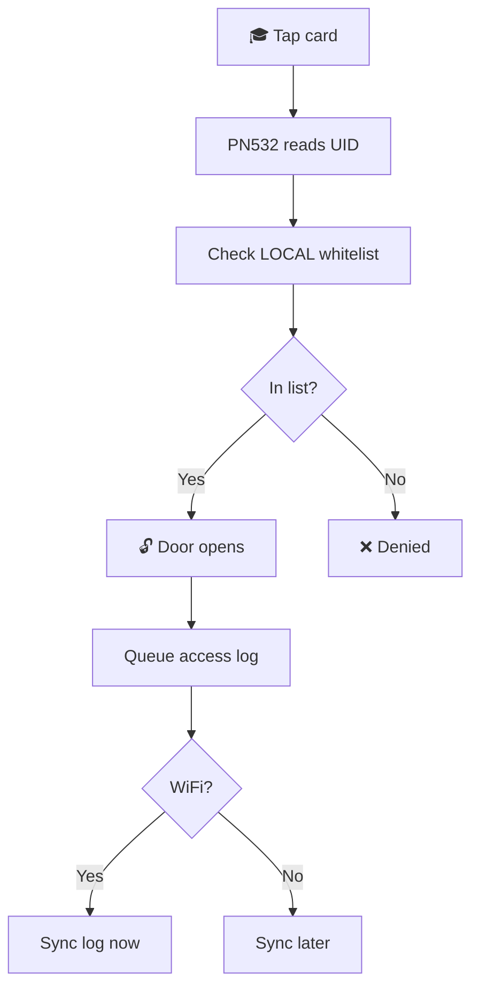
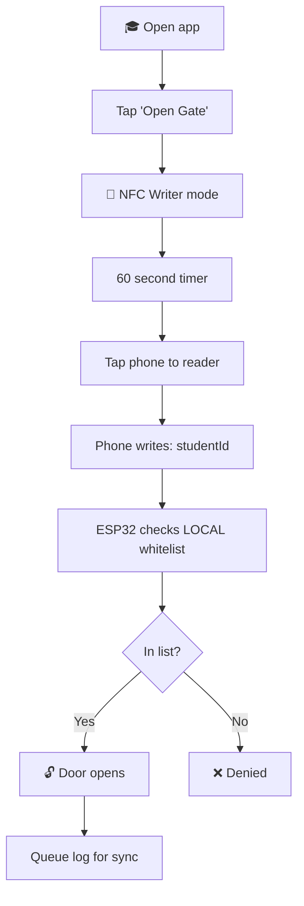
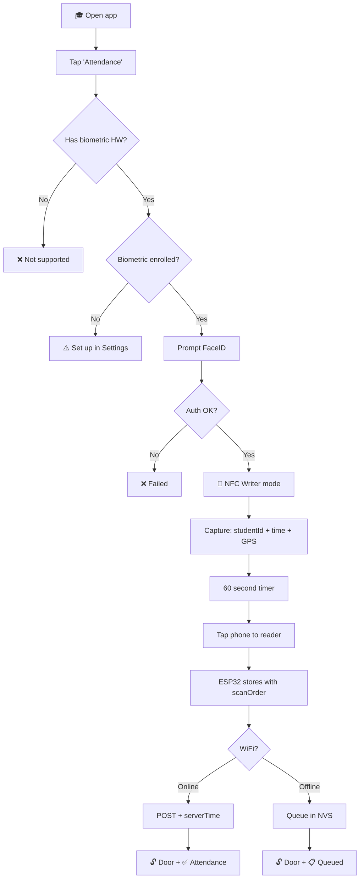
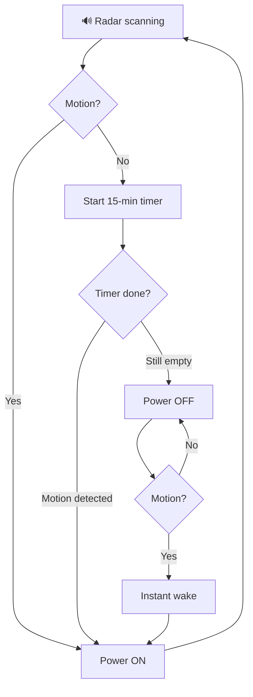
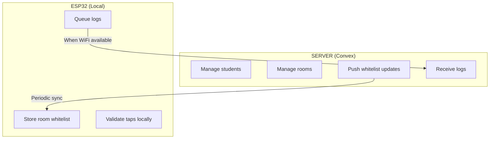
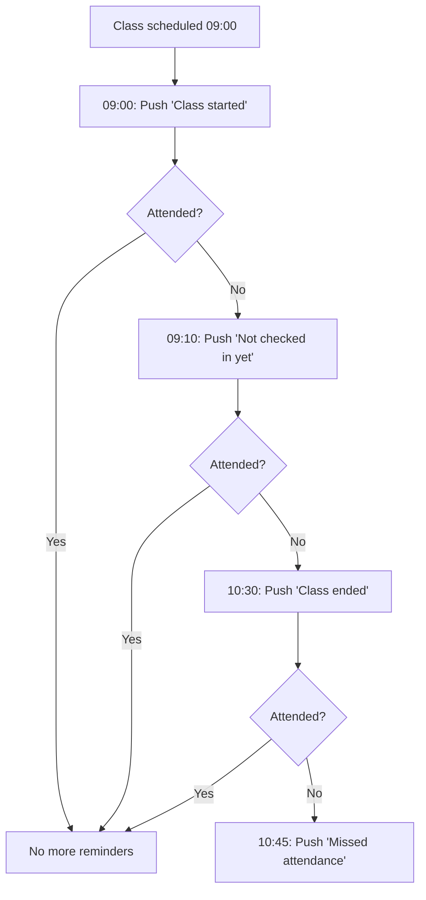

# 🏫 Smart Classroom System

A two-node wireless system for secure gate access and intelligent energy management.

---

## System Overview

| Node | Role | Components |
|------|------|------------|
| **Node A (Gatekeeper)** | Door access control | ESP32 + PN532 NFC + Relay |
| **Node B (Watchman)** | Occupancy monitoring & power control | ESP32 + HLK-LD2410C Radar + Relay |
| **Communication** | ESP-NOW (direct ESP-to-ESP) | ~50m indoor range |

---

## Hardware Inventory

| Component | Qty | Function | Placement |
|-----------|-----|----------|-----------|
| ESP32 WROOM-32 | 2 | Microcontrollers | Door frame / Ceiling |
| PN532 NFC Module | 1 | Reader/Tag Emulation | Outside door |
| HLK-LD2410C | 1 | mmWave Presence Sensor | Ceiling (facing room) |
| 5V Relay Module | 2 | Lock control / Power switch | Door frame / Electrical box |
| NTAG215 Cards | 10 | Physical student keys | Student possession |

---

## Wiring Diagrams

### Node A: Gatekeeper (Door)

| PN532 NFC | ESP32 Pin | Relay #1 | ESP32 Pin |
|-----------|-----------|----------|-----------|
| VCC | VIN (5V) | VCC | VIN (5V) |
| GND | GND | GND | GND |
| SDA | GPIO 21 | IN | GPIO 4 |
| SCL | GPIO 22 | — | — |

### Node B: Watchman (Ceiling)

| HLK-LD2410C | ESP32 Pin | Relay #2 | ESP32 Pin |
|-------------|-----------|----------|-----------|
| VCC | VIN (5V) | VCC | VIN (5V) |
| GND | GND | GND | GND |
| TX | GPIO 16 (RX2) | IN | GPIO 5 |
| RX | GPIO 17 (TX2) | — | — |

> ⚠️ **Critical:** Node B must be powered by a separate always-on circuit. If Relay #2 controls its own power, opening it kills the ESP32.

---

## User Flows

### Flow 1: Card Onboarding

Student links their physical NFC card to their account (one-time setup).



---

### Flow 2: Physical Card Access

Student taps card. **ALWAYS uses local whitelist (instant, no server call).**



> 💡 **No server call during tap.** Whitelist is pre-synced from server.

---

### Flow 3: Phone Access (Open Gate Only)

No biometric needed. **ALWAYS uses local whitelist.**



**Payload:** `{ studentId, action: "OPEN_GATE" }`

---

### Flow 4: Attendance (Biometric Required)

Opens door AND records attendance. **Requires FaceID/Fingerprint.**



**Payload:** `{ studentId, deviceTime, gps, action: "ATTENDANCE" }`

**ESP32 adds:** `{ scanOrder, espTime, synced: false }`

---

### Flow 5: Energy Saving

Radar cuts power when room is empty for 15 minutes.



| State | Power | Condition |
|-------|-------|-----------|
| OCCUPIED | ON | Motion detected |
| GRACE | ON | No motion, timer < 15 min |
| STANDBY | OFF | Timer expired |

---

## Offline Mode

System is **local-first**. No server calls during validation. Server only manages whitelist updates.

### Architecture



### What Happens When

| Event | Action |
|-------|--------|
| **Student taps** | Check LOCAL whitelist → instant response |
| **WiFi available** | Sync queued logs + check for whitelist updates |
| **Admin adds student** | Server updates whitelist → ESP32 pulls on next sync |
| **WiFi down** | Everything still works, logs queue locally |

### Timestamp Handling

| Mode | Source | Label | Accuracy |
|------|--------|-------|----------|
| Online | Server | `timestampServer` | ✅ Accurate |
| Offline | ESP32 | `timestampLocal` | ⚠️ May drift |

**On reconnect:** Calculate offset, correct queued records.

---

### Anti-Cheat Mechanisms

#### 1. Attendance Time Window

Attendance only valid within a time window around class schedule:

```
Class: 09:00 - 10:30

        VALID WINDOW
    ◄──────────────────────►
    
08:00   09:00        10:30   11:30
  │       │            │       │
  ├───────┼────────────┼───────┤
  │       │   CLASS    │       │
  │ 1 hr  │            │ 1 hr  │
  │BEFORE │            │ AFTER │
```

| Attempt Time | Class Time | Result |
|--------------|------------|--------|
| 08:30 | 09:00-10:30 | ✅ Valid (30 min before) |
| 09:15 | 09:00-10:30 | ✅ Valid (during class) |
| 11:00 | 09:00-10:30 | ✅ Valid (30 min after) |
| 14:00 | 09:00-10:30 | ❌ Rejected (too late) |
| 07:00 | 09:00-10:30 | ❌ Rejected (too early) |

#### 2. Phone Internet Check

Phone includes its internet status in the payload:

```json
{
  "studentId": "stu_123",
  "deviceTime": 1706012345,
  "timeSource": "ntp",      // "ntp" = internet time, "local" = device clock
  "hasInternet": true,
  "gps": { "lat": 13.7, "lng": 100.5 },
  "action": "ATTENDANCE"
}
```

| timeSource | Meaning | Trust Level |
|------------|---------|-------------|
| `ntp` | Phone fetched time from internet | ✅ High |
| `local` | Phone used device clock | ⚠️ Low |

#### 3. Suspicious Pattern Detection

Flag students who consistently have "no internet":

```typescript
// Server-side check
function checkSuspiciousPatterns(studentId: string, logs: AttendanceLog[]) {
  const recentLogs = logs.filter(l => l.studentId === studentId && isWithinDays(l, 7));
  const noInternetCount = recentLogs.filter(l => l.timeSource === "local").length;
  const totalCount = recentLogs.length;
  
  // If >50% of attendance has no internet in past week → suspicious
  if (noInternetCount / totalCount > 0.5) {
    alertAdmin({
      type: "SUSPICIOUS_PATTERN",
      studentId,
      message: `${noInternetCount}/${totalCount} scans with no internet this week`
    });
  }
}
```

**Red flags to auto-detect:**
| Pattern | Action |
|---------|--------|
| >50% "no internet" in 7 days | ⚠️ Flag to admin |
| Attendance outside time window | ❌ Reject |
| GPS > 100m from room | ⚠️ Flag to admin |
| deviceTime vs espTime > 5 min | 🚨 Use espTime only |

#### 4. Scan Order (Position)

Students can lie about timestamp. They **cannot** lie about position in line.

| scanOrder | studentId | deviceTime | espTime | Status |
|-----------|-----------|------------|---------|--------|
| 1 | stu_007 | 09:01:23 | 09:01:25 | ✅ OK |
| 2 | stu_003 | 09:01:45 | 09:01:30 | ✅ OK |
| 3 | stu_012 | **08:55:00** | 09:01:35 | 🚨 SUS |
| 4 | stu_001 | 09:02:10 | 09:01:40 | ✅ OK |

→ Student #3 claims 08:55 but is position 3. **Use espTime as truth.**

---

### Local Whitelist

Each ESP32 stores only students allowed in **its room**:

```json
{
  "whitelistVersion": 42,
  "entries": [
    { "cardUID": "04:A3:2B:...", "studentId": "stu_001" },
    { "cardUID": "04:B7:3C:...", "studentId": "stu_007" }
  ]
}
```

**Sync:** `GET /whitelist?room=101&version=42` → 304 or new list.

---

## Access Control Model

### Database Schema

```typescript
// students
{
  _id: "stu_12345",
  name: "John Doe",
  cardUID: "04:A3:2B:1C:7D:00:00",
  allowedRooms: ["room_101", "room_102"]
}

// rooms
{
  _id: "room_101",
  name: "Computer Lab 101",
  nodeId: "esp32_node_a_001",
  gps: { lat: 13.7563, lng: 100.5018 }
}

// accessLogs
{
  studentId: "stu_12345",
  roomId: "room_101",
  method: "card" | "phone",
  action: "OPEN_GATE" | "ATTENDANCE",
  result: "granted" | "denied",
  timestamp: "2026-01-22T10:30:00Z",
  timestampType: "server" | "local",
  scanOrder?: 5,
  gps?: { lat, lng }
}
```

---

## Security Strategy

| Layer | Implementation |
|-------|----------------|
| **Something you have** | NFC Card / iPhone |
| **Something you are** | FaceID (attendance only) |
| **Somewhere you are** | GPS verification |
| **Replay protection** | scanOrder + nonce |
| **Offline security** | Local whitelist, no signing keys |

### Threat Mitigations

| Threat | Mitigation |
|--------|------------|
| Fake studentId | Check whitelist |
| Fake timestamp | Use scanOrder + espTime |
| Fake GPS | Flag if > 100m from room |
| Replay attack | lastScan[studentId] < 30 min |
| Stolen ESP32 | No secrets stored |
| Power loss | NVS (flash), not RAM |

---

## Software Components

### Firmware (ESP32)
- [ ] NFC read/write handling
- [ ] Local whitelist validation
- [ ] Attendance queue (NVS)
- [ ] WiFi check + sync
- [ ] OTA updates
- [ ] NTP time sync

### Backend (Convex)
- [ ] Student/room management
- [ ] Whitelist endpoint
- [ ] Attendance validation
- [ ] Access logs

### Mobile App (iOS)
- [ ] NFC Writer mode (Core NFC)
- [ ] FaceID (LocalAuthentication)
- [ ] GPS capture
- [ ] Demo mode for App Store
- [ ] Push notifications (see below)

### Push Notifications

Server sends push notifications based on class schedule:

| Trigger | Time | Message |
|---------|------|---------|
| **Class starts** | Exact start time | "📚 CS101 has started in Room 101" |
| **Not attended** | 10 min after start | "⚠️ You haven't checked in for CS101 yet" |
| **Class ends** | Exact end time | "🔔 CS101 has ended" |
| **Still not attended** | 15 min after end | "❌ You missed CS101 attendance today" |



**Implementation:** Use scheduled push via Convex + Expo Push Notifications (or APNs).

---

## Development Phases

### Phase 1: Hardware ✅
- [x] Order components

### Phase 2: Validation
- [ ] ESP32 + PN532 (I2C)
- [ ] ESP32 + HLK-LD2410C (UART)
- [ ] ESP-NOW between nodes
- [ ] Relay actuation

### Phase 3: Core Logic
- [ ] 15-min timer
- [ ] NFC token read/write
- [ ] Convex backend

### Phase 4: Integration
- [ ] Node A ↔ Server ↔ Node B
- [ ] iOS app with FaceID + NFC
- [ ] End-to-end testing

### Phase 5: Deployment
- [ ] Install in classroom
- [ ] Wire to door lock
- [ ] Production deployment

---

## Bill of Materials

| Item | Price |
|------|-------|
| USB-C Cables (2) | $5.33 |
| HLK-LD2410C Radar | $2.20 |
| ESP32 WROOM-32 (2pcs) | $9.29 |
| PN532 NFC Module (2pcs) | $8.37 |
| 5V Relay Module (2pcs) | $1.32 |
| Dupont Wires | $3.99 |
| NTAG215 Cards (10pcs) | $6.48 |
| **Total** | **~$37** |

---

## Resources

- [ESP-NOW Docs](https://docs.espressif.com/projects/esp-idf/en/latest/esp32/api-reference/network/esp_now.html)
- [PN532 Library](https://github.com/adafruit/Adafruit-PN532)
- [HLK-LD2410 Library](https://github.com/ncmreynolds/ld2410)
- [Convex Docs](https://docs.convex.dev/)
