# 🏫 Smart Classroom System

A two-node wireless system for secure gate access and intelligent energy management.

---

## System Overview

| Node | Role | Components |
|------|------|------------|
| **Node A (Gatekeeper)** | Door access control | ESP32 + PN532 NFC + Relay |
| **Node B (Watchman)** | Occupancy monitoring & power control | ESP32 + HLK-LD2410C Radar + Relay |
| **Communication** | ESP-NOW (direct ESP-to-ESP) | ~50m indoor range |

---

## Hardware Inventory

| Component | Qty | Function | Placement |
|-----------|-----|----------|-----------|
| ESP32 WROOM-32 | 2 | Microcontrollers | Door frame / Ceiling |
| PN532 NFC Module | 1 | Reader/Tag Emulation | Outside door |
| HLK-LD2410C | 1 | mmWave Presence Sensor | Ceiling (facing room) |
| 5V Relay Module | 2 | Lock control / Power switch | Door frame / Electrical box |
| NTAG215 Cards | 10 | Physical student keys | Student possession |

---

## Wiring Diagrams

### Node A: Gatekeeper (Door)

| PN532 NFC | ESP32 Pin | Relay #1 | ESP32 Pin |
|-----------|-----------|----------|-----------|
| VCC | VIN (5V) | VCC | VIN (5V) |
| GND | GND | GND | GND |
| SDA | GPIO 21 | IN | GPIO 4 |
| SCL | GPIO 22 | — | — |

### Node B: Watchman (Ceiling)

| HLK-LD2410C | ESP32 Pin | Relay #2 | ESP32 Pin |
|-------------|-----------|----------|-----------|
| VCC | VIN (5V) | VCC | VIN (5V) |
| GND | GND | GND | GND |
| TX | GPIO 16 (RX2) | IN | GPIO 5 |
| RX | GPIO 17 (TX2) | — | — |

> ⚠️ **Critical:** Node B must be powered by a separate always-on circuit. If Relay #2 controls its own power, opening it kills the ESP32.

---

## User Flows

### Flow 1: Card Onboarding

Student links their physical NFC card to their account (one-time setup).

```mermaid
flowchart TD
    A[🎓 Student receives card] --> B[Opens app]
    B --> C[Taps 'Link Card']
    C --> D[📱 Phone reads card UID]
    D --> E{Success?}
    E -->|Yes| F[Send to server]
    E -->|No| G[❌ Retry]
    F --> H[✅ Card linked!]
    
    style H fill:#c8e6c9
    style G fill:#ffcdd2
```



---

### Flow 2: Physical Card Access

Student taps card to open door. **Works offline.**

```mermaid
flowchart TD
    A[🎓 Tap card] --> B[PN532 reads UID]
    B --> C{WiFi?}
    
    C -->|Online| D[Validate with server]
    C -->|Offline| E[Check local whitelist]
    
    D --> F{Valid?}
    E --> G{In list?}
    
    F -->|Yes| H[🔓 Door opens]
    F -->|No| I[❌ Denied]
    G -->|Yes| J[🔓 Door opens]
    G -->|No| K[❌ Denied]
    
    H --> L[Log immediately]
    J --> M[Queue log for sync]
    
    style H fill:#c8e6c9
    style J fill:#c8e6c9
    style I fill:#ffcdd2
    style K fill:#ffcdd2
```



---

### Flow 3: Phone Access (Open Gate Only)

No biometric needed. Just open the door.

```mermaid
flowchart TD
    A[🎓 Open app] --> B[Tap 'Open Gate']
    B --> C[📱 NFC Writer mode]
    C --> D[60 second timer starts]
    D --> E[Tap phone to reader]
    E --> F[Phone writes: studentId + OPEN_GATE]
    F --> G{WiFi?}
    
    G -->|Online| H[Server validates]
    G -->|Offline| I[Local whitelist]
    
    H --> J{Valid?}
    I --> K{In list?}
    
    J -->|Yes| L[🔓 Door opens]
    J -->|No| M[❌ Denied]
    K -->|Yes| N[🔓 Door opens]
    K -->|No| O[❌ Denied]
    
    style L fill:#c8e6c9
    style N fill:#c8e6c9
    style M fill:#ffcdd2
    style O fill:#ffcdd2
```



**Payload:** `{ studentId, action: "OPEN_GATE" }`

---

### Flow 4: Attendance (Biometric Required)

Opens door AND records attendance. **Requires FaceID/Fingerprint.**

```mermaid
flowchart TD
    A[🎓 Open app] --> B[Tap 'Attendance']
    B --> C{Has biometric HW?}
    
    C -->|No| D[❌ Not supported]
    C -->|Yes| E{Biometric enrolled?}
    
    E -->|No| F[⚠️ Set up in Settings]
    E -->|Yes| G[Prompt FaceID]
    
    G --> H{Auth OK?}
    H -->|No| I[❌ Failed]
    H -->|Yes| J[📱 NFC Writer mode]
    
    J --> K[Capture: studentId + time + GPS]
    K --> L[60 second timer]
    L --> M[Tap phone to reader]
    M --> N[ESP32 stores with scanOrder]
    
    N --> O{WiFi?}
    O -->|Online| P[POST + serverTime]
    O -->|Offline| Q[Queue in NVS]
    
    P --> R[🔓 Door + ✅ Attendance]
    Q --> S[🔓 Door + 📋 Queued]
    
    style D fill:#ffcdd2
    style F fill:#fff3e0
    style I fill:#ffcdd2
    style R fill:#c8e6c9
    style S fill:#c8e6c9
```



**Payload:** `{ studentId, deviceTime, gps, action: "ATTENDANCE" }`

**ESP32 adds:** `{ scanOrder, espTime, synced: false }`

---

### Flow 5: Energy Saving

Radar cuts power when room is empty for 15 minutes.


| State | Power | Condition |
|-------|-------|-----------|
| OCCUPIED | ON | Motion detected |
| GRACE | ON | No motion, timer < 15 min |
| STANDBY | OFF | Timer expired |

---

## Offline Mode

System works **100% offline** for door access. Attendance queues for sync.

### Decision Flow


### Timestamp Handling

| Mode | Source | Label | Accuracy |
|------|--------|-------|----------|
| Online | Server | `timestampServer` | ✅ Accurate |
| Offline | ESP32 | `timestampLocal` | ⚠️ May drift |

**On reconnect:** Calculate offset, correct queued records.

---

### Scan Order: Anti-Cheat

Students can lie about timestamp. They **cannot** lie about position in line.

| scanOrder | studentId | deviceTime | espTime | Status |
|-----------|-----------|------------|---------|--------|
| 1 | stu_007 | 09:01:23 | 09:01:25 | ✅ OK |
| 2 | stu_003 | 09:01:45 | 09:01:30 | ✅ OK |
| 3 | stu_012 | **08:55:00** | 09:01:35 | 🚨 SUS |
| 4 | stu_001 | 09:02:10 | 09:01:40 | ✅ OK |

→ Student #3 claims 08:55 but is position 3. **Use espTime as truth.**

---

### Local Whitelist

Each ESP32 stores only students allowed in **its room**:

```json
{
  "whitelistVersion": 42,
  "entries": [
    { "cardUID": "04:A3:2B:...", "studentId": "stu_001" },
    { "cardUID": "04:B7:3C:...", "studentId": "stu_007" }
  ]
}
```

**Sync:** `GET /whitelist?room=101&version=42` → 304 or new list.

---

## Access Control Model

### Database Schema

```typescript
// students
{
  _id: "stu_12345",
  name: "John Doe",
  cardUID: "04:A3:2B:1C:7D:00:00",
  allowedRooms: ["room_101", "room_102"]
}

// rooms
{
  _id: "room_101",
  name: "Computer Lab 101",
  nodeId: "esp32_node_a_001",
  gps: { lat: 13.7563, lng: 100.5018 }
}

// accessLogs
{
  studentId: "stu_12345",
  roomId: "room_101",
  method: "card" | "phone",
  action: "OPEN_GATE" | "ATTENDANCE",
  result: "granted" | "denied",
  timestamp: "2026-01-22T10:30:00Z",
  timestampType: "server" | "local",
  scanOrder?: 5,
  gps?: { lat, lng }
}
```

---

## Security Strategy

| Layer | Implementation |
|-------|----------------|
| **Something you have** | NFC Card / iPhone |
| **Something you are** | FaceID (attendance only) |
| **Somewhere you are** | GPS verification |
| **Replay protection** | scanOrder + nonce |
| **Offline security** | Local whitelist, no signing keys |

### Threat Mitigations

| Threat | Mitigation |
|--------|------------|
| Fake studentId | Check whitelist |
| Fake timestamp | Use scanOrder + espTime |
| Fake GPS | Flag if > 100m from room |
| Replay attack | lastScan[studentId] < 30 min |
| Stolen ESP32 | No secrets stored |
| Power loss | NVS (flash), not RAM |

---

## Software Components

### Firmware (ESP32)
- [ ] NFC read/write handling
- [ ] Local whitelist validation
- [ ] Attendance queue (NVS)
- [ ] WiFi check + sync
- [ ] OTA updates
- [ ] NTP time sync

### Backend (Convex)
- [ ] Student/room management
- [ ] Whitelist endpoint
- [ ] Attendance validation
- [ ] Access logs

### Mobile App (iOS)
- [ ] NFC Writer mode (Core NFC)
- [ ] FaceID (LocalAuthentication)
- [ ] GPS capture
- [ ] Demo mode for App Store

---

## Development Phases

### Phase 1: Hardware ✅
- [x] Order components

### Phase 2: Validation
- [ ] ESP32 + PN532 (I2C)
- [ ] ESP32 + HLK-LD2410C (UART)
- [ ] ESP-NOW between nodes
- [ ] Relay actuation

### Phase 3: Core Logic
- [ ] 15-min timer
- [ ] NFC token read/write
- [ ] Convex backend

### Phase 4: Integration
- [ ] Node A ↔ Server ↔ Node B
- [ ] iOS app with FaceID + NFC
- [ ] End-to-end testing

### Phase 5: Deployment
- [ ] Install in classroom
- [ ] Wire to door lock
- [ ] Production deployment

---

## Bill of Materials

| Item | Price |
|------|-------|
| USB-C Cables (2) | $5.33 |
| HLK-LD2410C Radar | $2.20 |
| ESP32 WROOM-32 (2pcs) | $9.29 |
| PN532 NFC Module (2pcs) | $8.37 |
| 5V Relay Module (2pcs) | $1.32 |
| Dupont Wires | $3.99 |
| NTAG215 Cards (10pcs) | $6.48 |
| **Total** | **~$37** |

---

## Resources

- [ESP-NOW Docs](https://docs.espressif.com/projects/esp-idf/en/latest/esp32/api-reference/network/esp_now.html)
- [PN532 Library](https://github.com/adafruit/Adafruit-PN532)
- [HLK-LD2410 Library](https://github.com/ncmreynolds/ld2410)
- [Convex Docs](https://docs.convex.dev/)
